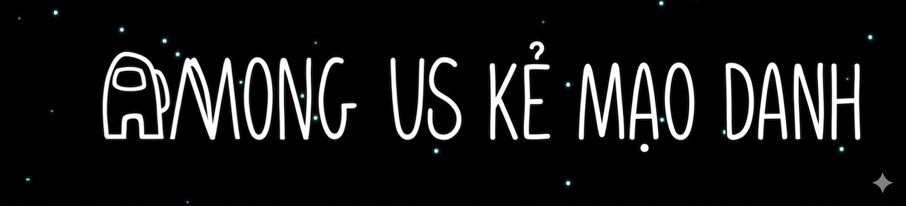

# Game 2D Unity - Kẻ Mạo Danh



## Tổng quan

- **Tên đề tài:** Trò chơi “Kẻ Mạo Danh”
- **Engine:** Unity 2D
- **Ngôn ngữ:** C#
- **Nền tảng:** Windows

### Bối cảnh
Trò chơi mô phỏng môi trường trạm không gian cô lập. Người chơi sẽ được phân vai thành:
- **Crewmate:** Hoàn thành nhiệm vụ và sống sót.
- **Impostor:** Phá hoại hệ thống và tiêu diệt phi hành đoàn.

Gameplay tập trung vào:
- Di chuyển nhân vật.
- Thực hiện nhiệm vụ.
- Random vai trò.
- Suy luận và sinh tồn.

---

## Gameplay Features

### Gameplay
- Di chuyển bằng Rigidbody2D.
- Animation nhân vật.
- Random vai trò Crewmate / Impostor.
- Logic thắng và thua.
- Spawn AI Puppet_Crewmate.

### Nhiệm vụ
- Download Task.
- Card Swipe Task.
- CCTV Task.
- Progress Bar nhiệm vụ.

### UI/UX
- Main Menu.
- About Panel.
- How To Play Video.
- Victory / Defeat UI.

### Âm thanh
- Nhạc nền.
- Tiếng bước chân.
- Âm thanh kill.
- Âm thanh thắng/thua.

---

## Review


---

## Công nghệ sử dụng

- Unity Engine
- C#
- Visual Studio 2022
- Git/GitHub
- Unity Animator
- Unity VideoPlayer

---

## Hướng dẫn cài đặt

### Yêu cầu
- Unity Hub
- Unity 6 hoặc phiên bản tương thích
- Visual Studio 2022
- Windows 10/11

---

### Clone project

```bash
git clone https://github.com/chuong-gif/Ke-Mao-Danh.git
```

```bash
cd Ke-Mao-Danh
```

### Mở project

1. Mở Unity Hub.
2. Chọn **Add Project**.
3. Chọn thư mục `Ke-Mao-Danh`.
4. Chờ Unity import package và asset.

---

### Chạy game

Mở scene:

```text
Assets/Scenes/MainMenu.unity
```

Nhấn nút:

```text
Play
```

---

### Build game

Vào:

```text
File → Build Settings
```

Chọn:

```text
Windows
```

Nhấn:

```text
Build
```

hoặc:

```text
Build And Run
```

---

## Điều khiển

| Phím | Chức năng |
| --- | --- |
| W A S D | Di chuyển |
| E | Tương tác |
| ESC | Pause/Menu |
| Chuột trái | UI Interaction |

---

## Cấu trúc project

---

## Nhóm thực hiện

| MSSV | Họ và tên | Email |
| --- | --- | --- |
| 2312607 | Nguyễn Ngọc Hân | 2312607@dlu.edu.vn |
| 2312697 | Nguyễn Thị Trường Nga | 2312697@dlu.edu.vn |
| 2312588 | Ngô Văn Chương | 2312588@dlu.edu.vn |

---

## Hướng phát triển

- Multiplayer Online.
- Voice Chat.
- AI nâng cao.
- Thêm map mới.
- Tối ưu hiệu năng.

---

## License

Dự án phục vụ mục đích học tập môn Lập Trình Game.
