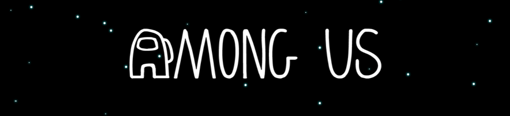
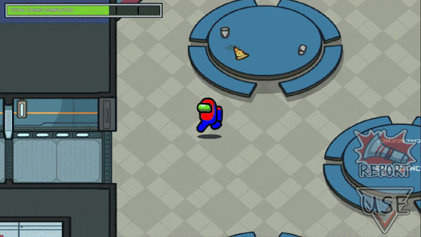
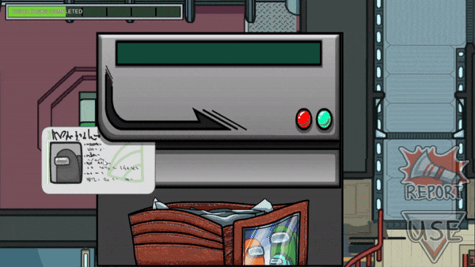

# Game 2D Unity - Kẻ Mạo Danh

## Tổng quan ##
- Tên đề tài: Trò chơi “Kẻ mạo danh” 
- Bối cảnh: Trò chơi giả lập môi trường trạm không gian cô lập. Một nhóm người chơi phải phối hợp để duy trì vận hành trạm, trong khi một số thành viên ẩn danh tìm cách phá hoại hệ thống và tiêu diệt phi hành đoàn.

## Thành viên ##
1	Nguyễn Ngọc Hân	2312607	CTK47A	2312607@dlu.edu.vn
2	Ngô Văn Chương	2312588	CTK47A	2312588@dlu.edu.vn
3	Nguyễn Thị Trường Nga	2312697	CTK47A	2312697@dlu.edu.vn

## Screenshots ##

 

## Công cụ ##
This project uses Unity Engine

